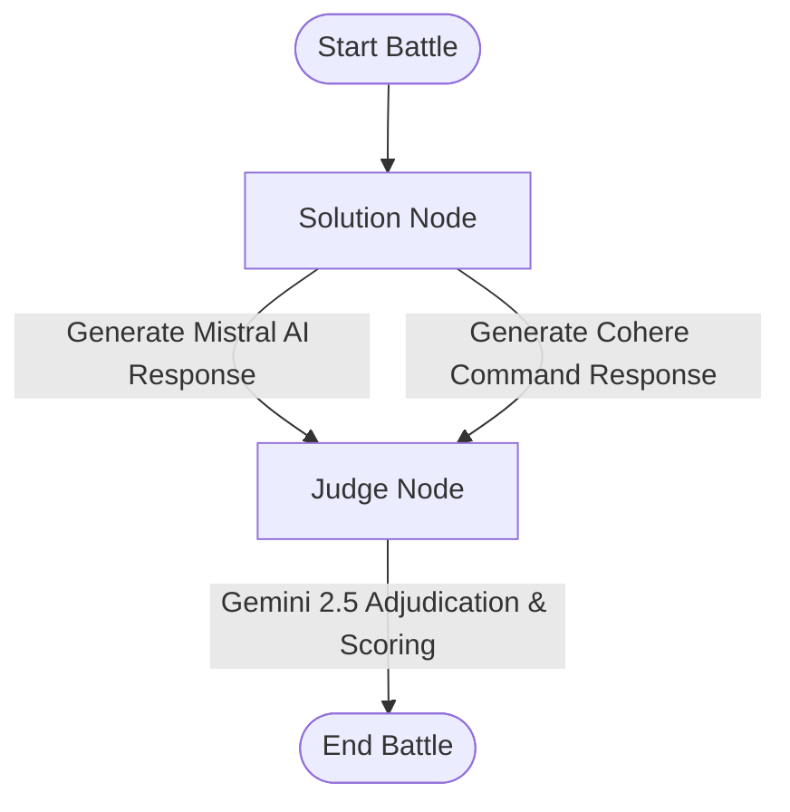

# ⚔️ AI Battle Arena

An interactive web application designed to pit Large Language Models (LLMs) against each other in logical and coding combat. The application orchestrates a battle between two competing LLMs and uses a third LLM to judge their outputs based on correctness, elegance, and completeness.

---

## 🌟 Features

- **Dual-Model Combat:** Mistral AI (`mistral-medium-latest`) and Cohere Command (`command-a-03-2025`) generate solutions to user-defined problems simultaneously.
- **Automated Adjudication:** Google Gemini (`gemini-2.5-flash`) acts as an impartial judge, evaluating both solutions, scoring them out of 10, and providing detailed qualitative feedback.
- **Modern Cyberpunk UI:** A visually stunning frontend built with glassmorphism, smooth animations, side-by-side solution comparisons, and a real-time terminal feel.
- **Stateful Multi-Agent Orchestration:** Powered by **LangGraph** to manage states, agent nodes, and the transition flow from generation to judging.

---

## 🛠️ Architecture Workflow

The system uses a state machine defined in LangGraph to process requests:



1. **Solution Node:** Receives the problem prompt and invokes Mistral and Cohere concurrently to get two distinct solutions.
2. **Judge Node:** Evaluates the problem alongside both solutions using Gemini, outputting scores and reasoning for each candidate in a structured format.

---

## 💻 Tech Stack

### Backend
- **Core:** Node.js, TypeScript, Express
- **Agent Framework:** `@langchain/langgraph`
- **LLM Integrations:** `@langchain/google`, `@langchain/mistralai`, `@langchain/cohere`
- **Validation:** Zod

### Frontend
- **Framework:** React.js, Vite
- **State Management:** Redux Toolkit
- **Styling & Icons:** Tailwind CSS, Lucide React
- **Animations:** Framer Motion

---

## 🚀 Getting Started

### Prerequisites
Make sure you have Node.js (v18+) and npm installed.

### 🔑 Environment Variables
Create a `.env` file inside the `backend` directory:
```env
PORT=3000
GOOGLE_API_KEY=your_gemini_api_key
MISTRAL_API_KEY=your_mistral_api_key
COHORE_API_KEY=your_cohere_api_key
```

---

## ⚙️ Installation & Running

### 1. Start the Backend
```bash
# Navigate to the backend directory
cd backend

# Install dependencies
npm install

# Run the development server
npm run dev
```
The backend server will start running at `http://localhost:3000`.

### 2. Start the Frontend
```bash
# Navigate to the frontend directory
cd frontend

# Install dependencies
npm install

# Run the development server
npm run dev
```
Open `http://localhost:5173` (or the URL provided by Vite) in your browser to experience the Battle Arena.

---

## 📁 Directory Structure

```
AI-battle-arena/
├── backend/
│   ├── src/
│   │   ├── config/          # Configurations & Dotenv loader
│   │   ├── services/        # LangGraph definitions & LLM initializations
│   │   └── app.ts           # Express endpoints & Middleware
│   ├── server.ts            # Entrypoint
│   └── tsconfig.json
└── frontend/
    ├── src/
    │   ├── components/      # UI components (Sidebar, ChatInput, Cards)
    │   ├── store/           # Redux slices for battle actions
    │   ├── App.jsx          # Main UI shell
    │   └── main.jsx         # React mounting
    └── package.json
```
